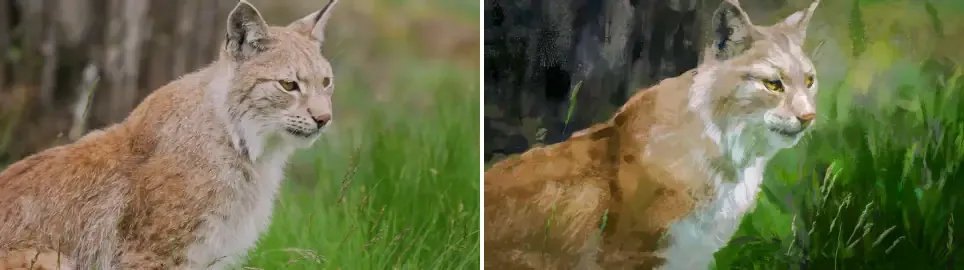

# Ebpynth [](https://xzzit.github.io/Ebpynth/examples/pipeline-animation.html)

[简体中文](./README_zh.md) | English

This is a pure Python and PyTorch reimplementation of [ebsynth](https://github.com/jamriska/ebsynth), the example-based image synthesis tool. The code has no compiled parts. Every stage is a tensor operation that you can step through and change. The run time is about 10 times the run time of the native kernel.

The synthesis has these steps:

1. **Pyramid.** Scale the style image and the guides to a coarse-to-fine pyramid.
2. **Match.** On each level, PatchMatch (propagation and random search) updates a nearest-neighbor field (NNF). The NNF maps each output pixel to a patch in the style image.
3. **Vote.** Each output pixel takes the average color of all patches that cover it.

PatchMatch is random and the code does not fix a seed. Two runs give equivalent results, not identical results. A CUDA GPU is required.

The [pipeline animation](./examples/pipeline-animation.html) shows these steps on real tensors from one run of the `stylit` example. Open the file in a browser. The text of the page is in Chinese.

## Examples

`examples/` has five use cases. Each command writes the `output.png` that the folder shows.

In the image tables, columns go from left to right: guides, then style. Rows go from top to bottom: source, then target. The bottom-right cell is the synthesized result. When an example has several guides, they share one cell, in the order of the column header.

### 1. Video frame

A hand-painted keyframe is transferred to a new frame. The guide is the raw frame pair that the painting came from.

```bash
python stylize.py \
  -style examples/frame/source_painting.jpg 0.5 \
  -guide examples/frame/source_frame.jpg examples/frame/target_frame.jpg \
  -output examples/frame/output.png \
  -extrapass3x3
```

|  | Guide — `frame` | Style |
|:--:|:--:|:--:|
| **Source** |  |  |
| **Target** |  | <a href="examples/frame/output.png"></a> |

### 2. Video

`stylize_video.py` stylizes a whole clip from a few painted keyframes. It uses the same engine as `stylize.py` and has four guide pairs for each frame:

1. **Color:** the video frame.
2. **Edge:** the edge map of the video frame.
3. **Positional:** a coordinate ramp that optical flow moves from frame to frame.
4. **Temporal:** the previous output, warped into the current frame.

Each output is the temporal guide of the next frame. The 100 frames form one chain, not 100 independent runs. This chain stops the flicker.

```bash
python stylize_video.py \
  -video examples/video/cat_full.mp4 \
  -styledir examples/video/style \
  -output examples/video/cat_styled.mp4
```

<p align="center">
  
</p>
<p align="center"><sub><b>Left:</b> source &nbsp;·&nbsp; <b>Right:</b> stylized &nbsp;·&nbsp; 100 frames, 960x540, 20 fps (preview at 10 fps, same clock)</sub></p>

- The keyframes are in `examples/video/style/`, named `style<frame>.png`. The frame number is only a hint. The code matches each keyframe to the video by edge correlation, because a stylized frame has the same shape as its source frame but a different palette. A wrong frame index would misalign every guide of that keyframe.
- Each frame is synthesized twice: forward from the previous keyframe and backward from the next keyframe. The two results are crossfaded.
- One frame takes about 7 s. 100 frames take about 35 minutes. Add `-maxframes 7` for a quick test.

### 3. Face portrait

The style of a portrait painting is transferred to a photo. The subject keeps its identity. Three guides come from facial landmarks, not from raw pixels:

- `Gapp`: the target luminance, matched to the painting.
- `Gseg`: a soft segmentation of the face.
- `Gpos`: a dense warp field from the target pixels to their source positions.

```bash
python stylize.py \
  -style examples/facestyle/source_painting.png \
  -guide examples/facestyle/source_Gapp.png examples/facestyle/target_Gapp.png 2.0 \
  -guide examples/facestyle/source_Gseg.png examples/facestyle/target_Gseg.png 1.5 \
  -guide examples/facestyle/source_Gpos.png examples/facestyle/target_Gpos.png 1.5 \
  -output examples/facestyle/output.png
```

|  | Guides — `Gapp`, `Gseg`, `Gpos` | Style |
|:--:|:--:|:--:|
| **Source** |    |  |
| **Target** |    | <a href="examples/facestyle/output.png"></a> |

### 4. Texture by numbers

A photo is resynthesized from a hand-painted target segmentation map. This example has one guide pair. It uses a smaller patch and a lower uniformity penalty than the defaults.

```bash
python stylize.py \
  -patchsize 3 -uniformity 1000 \
  -style examples/texbynum/source_photo.png \
  -guide examples/texbynum/source_segment.png examples/texbynum/target_segment.png \
  -output examples/texbynum/output.png
```

|  | Guide — `segment` | Style |
|:--:|:--:|:--:|
| **Source** |  |  |
| **Target** |  | <a href="examples/texbynum/output.png"></a> |

### 5. StyLit

A hand-painted shading style (an illuminated ball in colored pencil) is transferred to a 3D render. Four path-traced lighting passes are the guides, not the pixel colors:

- `fullgi`: full global illumination.
- `dirdif`: direct diffuse.
- `dirspc`: direct specular.
- `indirb`: indirect bounce.

The four guide weights sum to `2.0`. The ratio of guide weight to style weight is 2:1, the same as in the original StyLit example.

```bash
python stylize.py \
  -style examples/stylit/source_style.png \
  -guide examples/stylit/source_fullgi.png examples/stylit/target_fullgi.png 0.5 \
  -guide examples/stylit/source_dirdif.png examples/stylit/target_dirdif.png 0.5 \
  -guide examples/stylit/source_dirspc.png examples/stylit/target_dirspc.png 0.5 \
  -guide examples/stylit/source_indirb.png examples/stylit/target_indirb.png 0.5 \
  -output examples/stylit/output.png
```

<!-- Guides sit in a nested fixed 2x2 table (two <tr> of two <td>), so the grid never reflows with viewport width. -->

|  | Guides — `fullgi`, `dirdif`, `dirspc`, `indirb` | Style |
|:--:|:--:|:--:|
| **Source** | <table><tr><td></td><td></td></tr><tr><td></td><td></td></tr></table> |  |
| **Target** | <table><tr><td></td><td></td></tr><tr><td></td><td></td></tr></table> | <a href="examples/stylit/output.png"></a> |

## Installation

Tested on Windows 11 and Ubuntu 26.04 with Python 3.10, PyTorch 2.13.0 (CUDA 13.2) and an RTX 5070 Ti. A CUDA GPU is required. There is no CPU fallback.

1. Create and activate a conda environment:

   ```bash
   conda create -n ebpynth python=3.10
   conda activate ebpynth
   ```

2. Install [PyTorch](https://pytorch.org/get-started/locally/) and the other packages. `requirements.txt` installs the CUDA 13.2 build of PyTorch:

   ```bash
   pip install -r requirements.txt
   ```

## Usage

Run `stylize.py` with one style image and at least one guide pair:

```bash
python stylize.py \
  -style examples/frame/source_painting.jpg \
  -guide examples/frame/source_frame.jpg examples/frame/target_frame.jpg \
  -output output.png
```

- The source guide has the same size as the style image. Each pixel of the source guide matches a pixel of the style image.
- The target guide has the size of the output. Its content must match the output you want.
- Add a weight after `-style` or after the two paths of `-guide` to change its influence. Repeat `-guide` for more guide pairs.
- Use `-extrapass3x3` to add a final pass with 3x3 patches. It sharpens fine detail.

## Options

Options of `stylize.py`:

| Argument | Type | Default | Description |
|:---:|:---:|:---:|:---:|
| `-style` | path [float] | required | Style image, followed by an optional weight (default `1.0`). The output takes all its color from this image. |
| `-guide` | path path [float] | required | Source guide and target guide, followed by an optional weight (default `1/N` for N guides). Use the argument once for each guide pair. |
| `-output` | path | `output.png` | Path of the output image. The file is always a PNG. |
| `-uniformity` | float | `3500.0` | Penalty for a source patch that many output patches use. A high value spreads the matches over the style image. |
| `-patchsize` | integer | `5` | Side length of the square patch, in pixels. The value must be odd and at least `3`. |
| `-pyramidlevels` | integer | `-1` | Number of pyramid levels. `-1` derives the number from the image size and the patch size. |
| `-searchvoteiters` | integer | `6` | Number of match and vote rounds on each pyramid level. |
| `-patchmatchiters` | integer | `4` | Number of propagation and random-search iterations in each match round. |
| `-stopthreshold` | integer | `5` | Accepted for compatibility with the original CLI. The code does not use it. |
| `-extrapass3x3` | flag | off | Add a final pass with 3x3 patches. |
| `-h`, `--help` | flag | - | Show the help message and exit. |

`stylize_video.py` accepts `-uniformity`, `-patchsize`, `-pyramidlevels`, `-searchvoteiters`, `-patchmatchiters` and `-extrapass3x3` with the values above. It has these other options:

| Argument | Type | Default | Description |
|:---:|:---:|:---:|:---:|
| `-video` | path | `examples/video/cat_full.mp4` | Input video. |
| `-styledir` | path | `examples/video/style` | Folder with the painted keyframes, named `style<frame>.png`. |
| `-outdir` | path | `examples/video/out` | Folder for the PNG file of each frame. |
| `-output` | path | `examples/video/cat_styled.mp4` | Path of the output video. |
| `-height` | integer | `540` | Number of rows to keep in each decoded frame. The encoder pads the frame at the bottom. |
| `-maxframes` | integer | `-1` | Stop after this number of frames. `-1` processes all frames. |
| `-smallflow` | flag | off | Use the smaller RAFT model (`raft_small`) instead of `raft_large`. |

`texbynum` is the only example that sets `-patchsize` and `-uniformity`. The other examples use the defaults for these two options.

## Project Structure

```text
Ebpynth/
├── arguments/
│   └── parser.py            # Parser for the command-line arguments
├── utils/
│   ├── image_io.py          # Image loading and saving as CUDA uint8 tensors
│   ├── guide_merge.py       # Merge of the guide pairs into feature tensors
│   └── pyramid_plan.py      # Number of pyramid levels and settings of each level
├── synthesis/               # PatchMatch blocks that stylize.py calls in order
│   ├── nnf.py               # Random initialization of the NNF
│   ├── cost.py              # Weighted patch distance (SSD)
│   ├── propagate.py         # Neighbor propagation with jump flooding
│   ├── random_search.py     # Random search for better matches
│   ├── vote.py              # Image reconstruction from the NNF
│   ├── pyramid.py           # Level sizes, image resizing and NNF upscaling
│   └── uniformity.py        # Penalty for overused source patches
├── video/                   # Blocks that stylize_video.py uses
│   ├── frames.py            # Video decoding and encoding as CUDA uint8 tensors
│   ├── flow.py              # RAFT optical flow and the warp for the time guides
│   └── guides.py            # Edge guide and coordinate ramp
├── examples/                # One folder for each use case
│   ├── frame/               # Single-frame stylization
│   ├── video/               # Video clip and painted keyframes
│   ├── facestyle/           # Face portrait
│   ├── texbynum/            # Texture by numbers
│   ├── stylit/              # Illumination-guided 3D render
│   └── pipeline-animation.html # Step-by-step animation of one run
├── scripts/                 # Capture of the data for the animation
│   ├── capture_pipeline_trace.py # Run of the stylit example with a fixed seed
│   ├── inject_trace.py           # Insert of the captured data into the HTML file
│   └── trace_utils.py            # Helpers for the capture
├── stylize.py               # Image entry point: the whole pipeline, step by step
└── stylize_video.py         # Video entry point: keyframe propagation and crossfade
```

Most modules have a self-test. Run it from the repository root, for example `python synthesis/vote.py`.

## Reference

- ebsynth: <https://github.com/jamriska/ebsynth>
- Jamriška et al. *Stylizing Video by Example*. ACM Transactions on Graphics (SIGGRAPH 2019).
- Barnes et al. *PatchMatch: A Randomized Correspondence Algorithm for Structural Image Editing*. ACM Transactions on Graphics (SIGGRAPH 2009).
